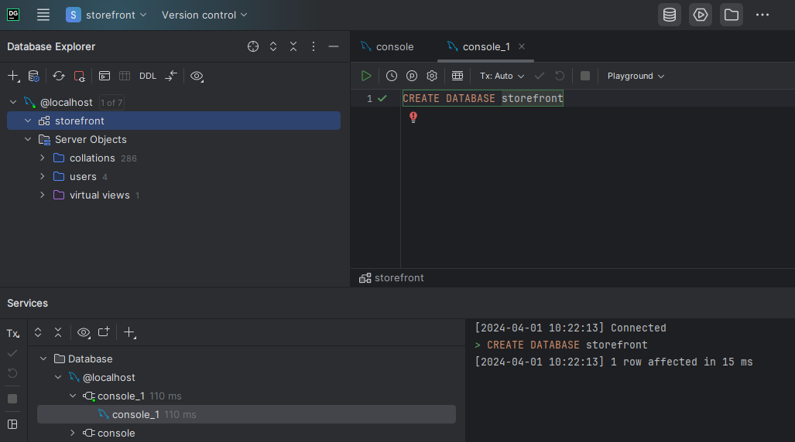

# WHAT I LEARNT

---

## Title 1

text

---

## Introduction to MYSQL

Here I only just touched the surface of Databases. Installing MYSQL and DataGrip and creating a new database in DataGrip.  
Why DataGrip? Just because the course I am following is using it. But MYSQL Workbench is an alternative (though less optimal, according to the course). 

--- 

## Title 3

Text

--- 

## How Well Did I do?

After I compared my code to the solutions: 
- **exercise **:  
  Text 

  GRADE: Text. 

- **exercise **:  
  Text. 

- **exercise **:

#### Resources:
[Code with Mosh Online Course: Ultimate Django](codewithmosh.com/courses/the-ultimate-django-part1-1)  
[DataGrip from Jetbrains](https://www.jetbrains.com/datagrip/download/download-thanks.html?platform=windows)  
[MySQL](https://dev.mysql.com/downloads/windows/)  

